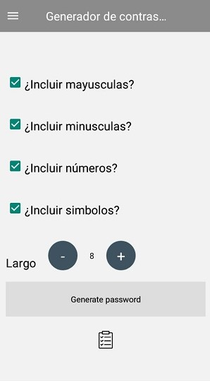

# PasswordApp

## Descripción

El presente codigo fuente pertenece a un proyecto personal de almacenamiento de contraseñas de manera segura.

La aplicacion posee las siguientes funcionalidades:

* Apertura de la App a través de una contraseña maestra.
* Almacenamiento de usuarios y contraseñas de nuestras diferentes cuentas cifrando las contraseñas con la contraseña del punto anterior. (El algoritmo utilizado para el cifrado es AES)
* Generacion de contraseñas aleatorias

## Screenshots

  

 
